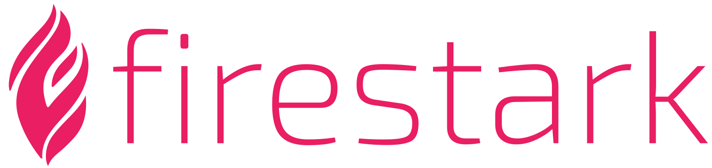

Firestark is a **non MVC PHP7 framework** which separates business logic from implementation logic. Firestark achieves this separation by giving you a special architecture that completely rids the business logic from outside dependencies. Instead the implementation logic is responsible for dependencies and speaks with the businesses logic to make a working application. This way the business logic is a very simple and readable layer to work in.

```php
<?php
    
when ( 'i want to add a todo', then ( apply ( a ( 
    
function ( todo $todo, todo\manager $manager )
{
    if ( $manager->has ( $todo->description ) )
        return [ 2000, [ ] ];

    $manager->add ( $todo );
    return [ 1000, [ ] ];
} ) ) ) );
```

> Example 1. A business procedure example


# The architecture

Your application is split up into two layers. One layer is the business logic layer. This layer is responsible for enforcing business rules and returning a status code. The other layer is the implementation layer. This layer is responsible for implementing the business logic layer to create a working application.

## The business logic

The business logic layer is split up in *agreements* and *procedures*. Agreements consist of **self contained** classes, abstract classes and interfaces. These agreements may contain some *non application specific business rules* that always have to be enforced. An example of that could be: A person has to be above the age of 18 to be allowed to buy products in our store. If this rule needs to be enforced for the entire business and not just this application it is a good idea to put that rule in an agreement. 

procedures are small functions that use agreements to enforce *application specific business rules*. A procedure always returns a status code. That status code is an integer and is up to the developer to decide what integer to return based on the results of the applied business rules. **Example 1 above ** is an example of a procedure.

The most important thing to understand here is that this layer may know nothing about implementation details. This means that this layer knows nothing about what database is used or how it is delivered to the client (HTML, JSON).  

## The implementation logic

The implementation logic consists of routing, services, facades, status matchers and IOC bindings. These are the technical components we use to create a working application.

### Services

Agreements inside the business logic may know nothing about technical details. Because of this the agreements can not directly talk to a database. To still be able to store changes in a database we create a service inside the implementation layer that extends or implements the agreement. This service can talk to a database to store changes.

### IOC bindings

Bindings are a map of key, value pairs we register inside the application. The key can be any string you like. The value is a closure that returns any value you want. Whenever you resolve the key from the application you will get the value that the closure returns. 

One of the major use cases of bindings are resolving the procedure parameters inside the business logic. Whenever the application encounters a type hinted class parameter it will look into it's bindings for a key of that type hinted full class-name. This is the way we provide the procedures the parameters it needs.

### Status matchers

With a status code the business logic communicates an arbitrary meaning to the implementation layer. It's the responsibility of the status matcher to match that status code and turn that arbitrary meaning into a HTTP response.

### Facades

Facades give static access to technical components and are used inside the implementation layer only. With a facade we don't need an instance of a component but instead use the facade with a static call directly. Facades are really useful in situations where we want access to technical components but don't really want to inject them as function arguments.

### Routes

Routes are a map of key, value pairs. The key is a HTTP URI. The value is a closure which either calls a business procedure and returns that result or returns an HTTP response.

## Directory structure

| Directory        | Description                  |
| ---------------- | ---------------------------- |
| /app             | Business logic               |
| /app/procedures  | Business logic procedures    |
| /app/agreements  | Business logic entities      |
| /client          | Technical layer              |
| /client/services | Implementation of agreements |
| /client/bindings | App implementations bindings |
| /client/routes   | Http routes                  |
| /client/statuses | Business status matchers     |
| /client/facades  | Technical facades            |


## Getting started

### Server requirements

- PHP >= 7.1.3
- Host pointing to / (for example: virtual host)

### Installation

1. `composer create-project firestark/project`
2. Make sure the application can write inside the client/storage directory